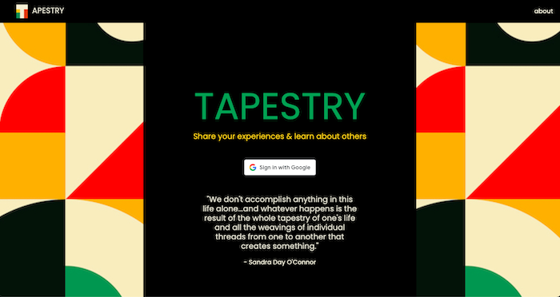
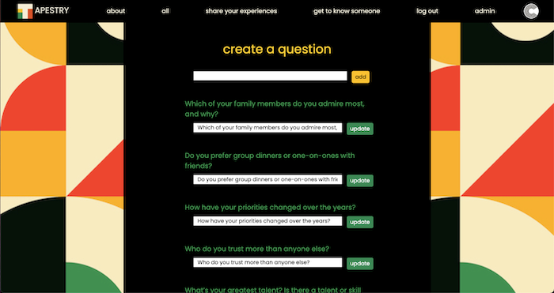

# TAPESTRY

 ## Description
 **"We don't accomplish anything in this life alone...and whatever happens is the result of the whole tapestry of one's life and all the weavings of individual threads from one to another that creates something." - Sandra Day O'Connor** 
 
 Tapestry stems from a project that I started over the Pandemic with my dad. Realizing I had taken for granted the trips to visit my parents on the other side of the world, I started a correspondence with my dad to record his thoughts, advice and life experiences. 
  
 Tapestry is an app designed for contemplation, genuine interactions, to share and learn about others. 

1. AAU Admin, I am the only one who will be able to add/update questions.
2. AAU I want to login/logout to access my Q&As to answer/edit/update, and to read other's Q&As.
3. AAU after logging in, I want to view the latest Q&As answered (a feed).
4. AAU if I want to go back to the home page I can click TAPESTRY on the nav bar.
5. AAU I want to see all my Q&As on one page, and be able to edit or delete.
6. AAU I want my cards to be accessible to READ ONLY by other users. (I want to read other people's Q&A but I shouldn't be able to do anything more than that.)
 
 
 ## Visual Inspiration
 With the app's title being Tapestry, it brought to mind Annie Albers who was an artist, weaver, and participant in the Bauhaus art movement during the early 1920's.  This movement included not only art, but spanned typography, architecture and the crafts.  Their design principles included, "less is more" and "form follows funciton". Not only did I use this as a guiding light for the aesthetic, but followed their principles when decisions needed to be made.

 
Admin view above

 

 ## Get started [here](https://carolkang-tapestry-app.fly.dev/)  
 

 ## Planning
[Trello](https://trello.com/b/BkJuXJX5/tapestry#) 
[Whimsical: layout](https://whimsical.com/tapestry-wireframe-21xQHN61MSmwdjwf2zcKSa) 
[Whimsical: ERD](https://whimsical.com/tapestry-erd-RZSGoCAxZ3xha1H4vcQZoi) 

 

 ## Technologies Used
Mongoose, MongoDB, Express, Node, JavaScript (and embedded in HTML), CSS, Git, Bootstrap, Trello, Whimsical, Fly.io, Google OAuth 
 

 ## Credits
- [Background Image](https://www.freepik.com/free-photos-vectors/bauhaus)
- [Font](https://fonts.google.com/)
- Questions came from googling "opposite of small talk", many sources, these are the primary:
  - [Questions](https://thoughtcatalog.com/melanie-berliet/2016/01/50-revealing-questions-that-arent-too-deep-so-you-can-skip-the-small-talk-on-every-date/)
  - [More Questions](https://beardstrokings.com/conversation-starters-that-skip-small-talk/)

 

 ## Next Steps 
- List the commenter next to the comment 
- Allow the admin or answer author to delete anyone's comments or answers 
- Create a view where users can click on a question, and in a view see everyone who answered that question's answers 
